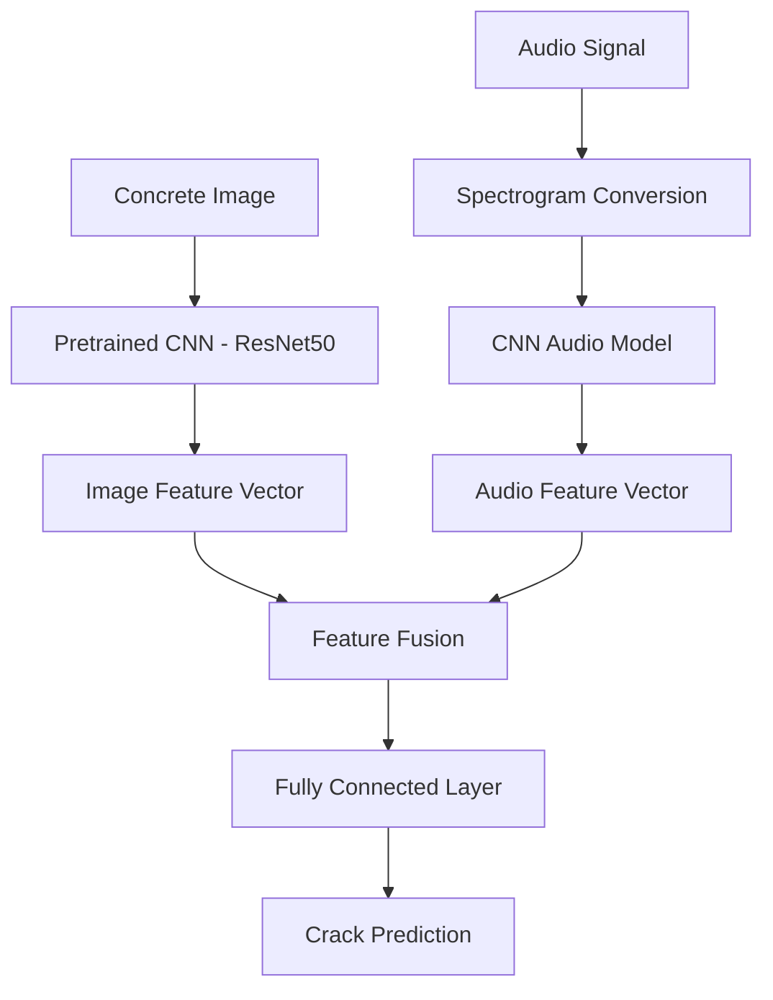

# Multimodal Concrete Crack Detection

### Visual + Acoustic Structural Analysis

---

# Project Overview

This project demonstrates a **multimodal machine learning framework for detecting cracks in concrete structures** by combining **visual inspection** with **acoustic signal analysis**.

Traditional structural inspection systems typically rely on **a single sensing modality**, most commonly visual inspection. While computer vision models are capable of detecting surface cracks with high accuracy, they cannot reliably detect **subsurface defects, internal cracks, or structural anomalies**.

To address this limitation, engineers often combine multiple sensing techniques such as:

- visual inspection
- ultrasonic testing
- acoustic emission monitoring
- vibration analysis
- impact echo testing

This project replicates that engineering concept using **multimodal machine learning**.

The system integrates:

1. **Visual data (concrete crack images)**
2. **Acoustic signal data (structural sound representations)**

Both modalities are processed independently using deep learning models, and their extracted features are fused to generate a **final crack detection prediction**.

---

# Definition of Multimodality

In machine learning, **multimodal learning refers to systems that use multiple types of data representations to perform a task**.

A **modality** is a distinct type of data input.

Examples include:

| Modality | Data Type |
|--------|-----------| Image | Pixel data |
| Audio | Time‑series waveform |
| Text | Natural language |
| Sensor data | Numerical measurements |
| Thermal | Infrared images |

Multimodal systems combine **two or more of these modalities** to improve decision-making.

In this project the modalities are:

1. **Visual modality** – concrete surface images
2. **Acoustic modality** – structural vibration / sound signals

---

# System Architecture

The system follows a **dual-branch multimodal architecture**.

Each modality is processed using its own feature extraction model before features are combined.

## Architecture Diagram



---

# Modality 1 – Visual Crack Detection

## Dataset

The visual branch uses the **Concrete Crack Images Dataset**.

Dataset characteristics:

- ~40,000 images
- Image resolution: **227 × 227**
- Binary classification:
  - Crack
  - No Crack

Images represent different concrete surfaces including:

- bridge decks
- pavements
- structural walls

This dataset is widely used in civil engineering and computer vision research.

---

## Image Model

The visual branch uses **transfer learning** with a pretrained CNN.

Possible models:

- ResNet50
- EfficientNet
- MobileNetV2

Transfer learning allows the system to reuse knowledge from **ImageNet-trained networks**, significantly reducing training time.

### Visual Processing Pipeline

Concrete Image  
→ Resize + Normalize  
→ Pretrained CNN Backbone  
→ Image Feature Vector

The model learns visual crack characteristics such as:

- line discontinuities
- crack orientation
- edge patterns
- surface texture irregularities

---

# Modality 2 – Acoustic Structural Signals

## Motivation

In structural health monitoring systems, engineers frequently use **acoustic and ultrasonic methods** to detect internal defects.

Common techniques include:

- ultrasonic pulse velocity testing
- acoustic emission monitoring
- impact echo analysis
- vibration monitoring

Structural cracks alter how **acoustic waves propagate through concrete**, producing detectable changes in signal properties such as:

- frequency distribution
- amplitude attenuation
- resonance patterns

---

## Audio Representation

Audio signals are converted into **spectrograms**, which represent frequency content over time.

Pipeline:

Audio Waveform  
→ Short-Time Fourier Transform (STFT)  
→ Mel Spectrogram  
→ Spectrogram Image

Spectrograms allow CNNs to analyze audio signals similarly to images.

---

## Audio Model

The acoustic branch uses a lightweight CNN to process spectrograms.

Processing pipeline:

Spectrogram  
→ Convolutional Neural Network  
→ Audio Feature Vector

The model learns acoustic patterns associated with structural anomalies such as:

- abnormal vibration frequencies
- irregular acoustic bursts
- energy distribution changes

---

# Multimodal Feature Fusion

After both branches extract features, they are combined using **mid-level feature fusion**.

Image Feature Vector

- Audio Feature Vector  
  ↓  
  Concatenated Feature Representation

The combined feature vector is passed into a **classification network**.

Classifier pipeline:

Combined Features  
→ Fully Connected Layer  
→ Activation Function  
→ Crack Prediction

Output:

- Crack detected
- Confidence score

---

# Demonstration Pipeline

The following pipeline demonstrates how the multimodal system works.

## Step 1 – Image Processing

1. Input concrete image
2. Preprocess image
3. Pass through pretrained CNN
4. Extract visual feature vector

## Step 2 – Audio Processing

1. Load acoustic signal
2. Convert audio to spectrogram
3. Pass through CNN audio model
4. Extract audio feature vector

## Step 3 – Feature Fusion

1. Concatenate image and audio features
2. Feed into classification layer
3. Generate final crack prediction

---

# Example Demo Code Structure

```
project/
│
├── datasets/
│   ├── concrete_images/
│   └── audio_signals/
│
├── models/
│   ├── image_model.py
│   ├── audio_model.py
│   └── fusion_model.py
│
├── utils/
│   ├── audio_processing.py
│   └── image_processing.py
│
├── train_image_model.py
├── train_audio_model.py
├── multimodal_inference.py
│
└── README.md
```

---

# Example Fusion Logic (Concept)

```
image_features = image_model(image)

audio_features = audio_model(spectrogram)

combined = torch.cat((image_features, audio_features), dim=1)

prediction = classifier(combined)
```

---

# Advantages of the Multimodal Approach

| Method            | Capability                   |
| ----------------- | ---------------------------- |
| Visual inspection | Detects surface cracks       |
| Acoustic analysis | Detects structural anomalies |
| Multimodal fusion | Improves reliability         |

Benefits include:

- increased detection robustness
- reduced false positives
- improved structural assessment

---

# Future Work

Possible improvements include:

- real ultrasonic sensor datasets
- thermal imaging modality
- transformer-based multimodal models
- edge deployment on inspection drones
- synchronized multimodal datasets

---

# Conclusion

This project demonstrates a **multimodal deep learning architecture for concrete crack detection**.

By combining **visual inspection with acoustic signal analysis**, the system mimics real-world structural health monitoring techniques used in civil engineering.

The implementation highlights how multiple sensing modalities can be integrated into a unified machine learning framework to improve infrastructure inspection systems.
